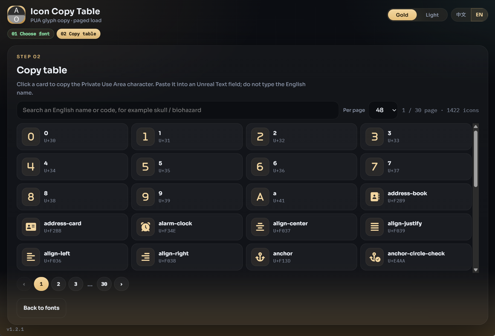

<div align="center">

# Icon Copy Table

**Packed via Axiox Media**

A two-step Windows desk app that pages Font Awesome Free Solid, Regular, and Brands Regular glyphs and copies the Private Use Area character for Unreal Text fields.

<p>
  <a href="docs/README-zh.md"></a>
</p>

<p>
  <a href="#install">Install</a> ·
  <a href="#features">Features</a> ·
  <a href="#requirements">Requirements</a> ·
  <a href="#architecture">Architecture</a> ·
  <a href="#documentation">FAQ</a>
</p>

<p>
  
  
  
  
</p>

</div>

<div align="center">
  
</div>

> [!NOTE]
> The packed EXE is unsigned. Windows SmartScreen may warn on first launch.

---

## At a glance

| Item | Value |
|---|---|
| Product | Icon Copy Table |
| Steps | Choose font → paged copy table |
| Families | Solid, Regular, Brands Regular |
| Catalog | Font Awesome Free 7.3.1 |
| UI | White canvas, black type, zh / en |

<a id="install"></a>

## Install

### 1. GitHub Deploy Desk (recommended)

One-click deploy this repository with [GitHub Deploy Desk](https://github.com/axioxmedia/github-deployer).

1. Get the deployer: https://github.com/axioxmedia/github-deployer
2. Paste this repo URL into Deploy Desk.
3. Read the README in the app, then confirm deploy.

That is the supported install path. Use the source / EXE steps below only if you are already building from a local checkout.

### 2. Run from source or freeze an EXE

| Path | Command |
|---|---|
| Source | `start.bat` |
| EXE | `build_exe.bat` → `dist\IconCopyTable.exe` |
| PowerShell | `powershell -ExecutionPolicy Bypass -File .\build_exe.ps1` |

Requires Python 3.11+ with “Add python.exe to PATH”.

<a id="features"></a>

## Features

| Feature | Detail |
|---|---|
| Family picker | Three buttons only: Solid, Regular, Brands Regular |
| Paged table | 24 / 48 / 72 / 96 icons per page; the catalog is not dumped in one paint |
| Copy | Click a card to copy the PUA character, not the English class name |
| Search | Filters the current family by name, label, terms, or hex code |
| Local fonts | Bundled TTF faces, no CDN |
| Memory | Last family, page size, query, and UI language survive relaunch |

<a id="requirements"></a>

## Requirements

| | Minimum | Recommended |
|---|---|---|
| OS | Windows 10 | Windows 11 |
| Python | 3.11 | 3.12 |
| Display | 1280×720 | 1280×860 |

<a id="architecture"></a>

## Architecture

FastAPI serves `/api/icons` pages and the three TTF files. The static wizard talks to `127.0.0.1`. pywebview wraps that URL. PyInstaller freezes the helper into a windowed onefile EXE.

```
UI wizard  →  FastAPI 127.0.0.1  →  static/data/*.json + static/fonts/*.ttf
                                 →  pywebview window / IconCopyTable.exe
```

<a id="documentation"></a>

## Documentation

<details>
<summary>How do I paste into Unreal Engine?</summary>

Select a family, open the table, click a card, then paste into the Unreal Text field. Do not type `fa-skull` or similar class names.

</details>

<details>
<summary>Why are Regular and Brands shorter than Solid?</summary>

Font Awesome Free ships a full Solid set, a smaller Regular outline set, and a separate Brands Regular set. The app only lists glyphs that exist in the selected face.

</details>

Packed via Axiox Media · [axiox.media](https://axiox.media)
